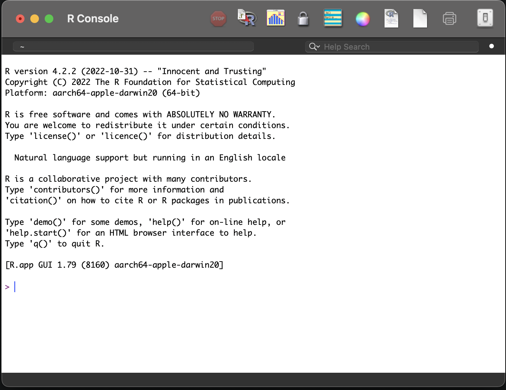
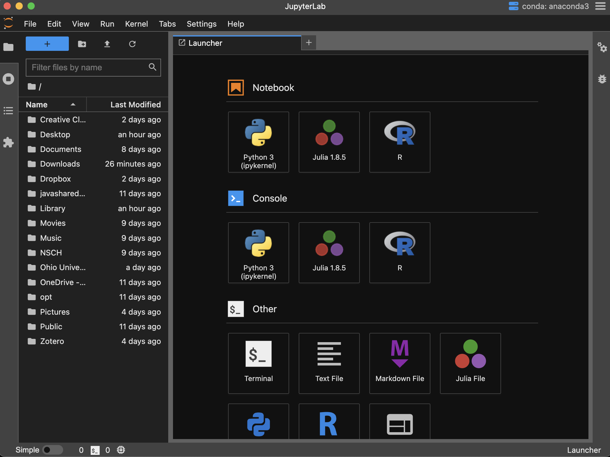
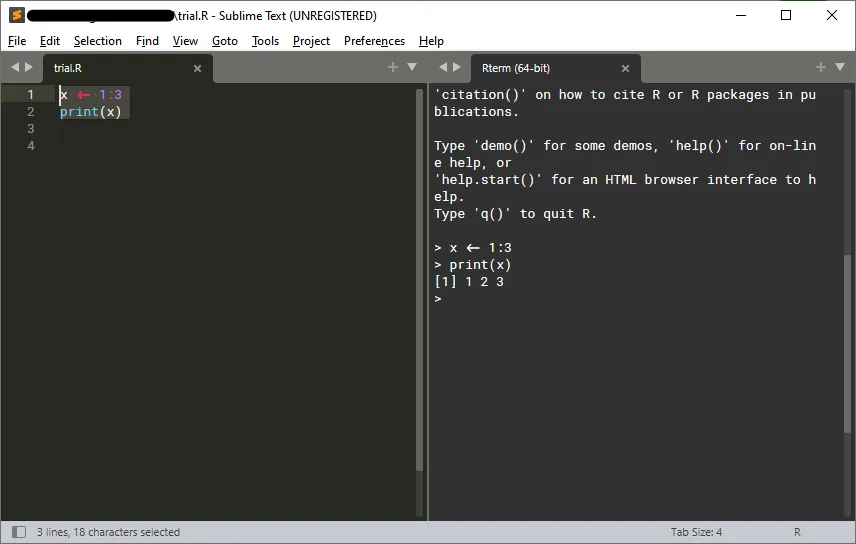
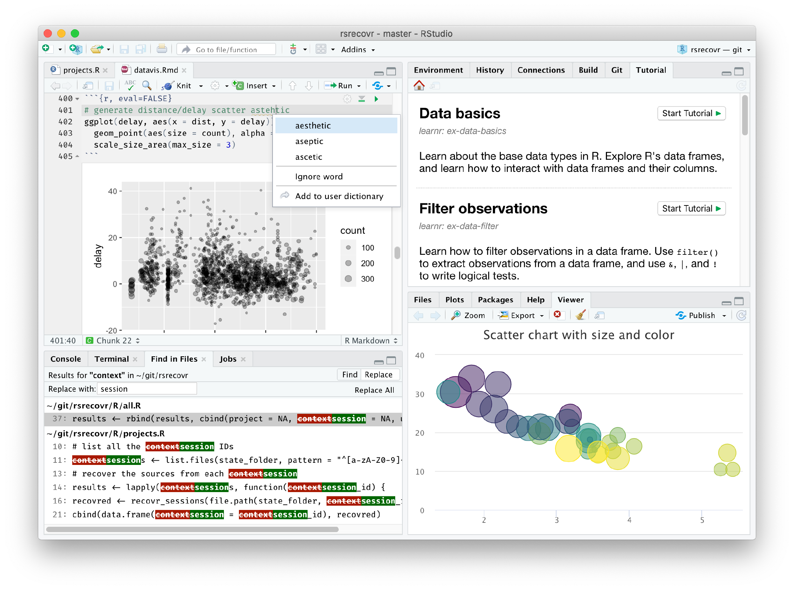

<script type="text/x-mathjax-config">
  MathJax.Hub.Register.StartupHook("TeX Jax Ready",function () {
    MathJax.Hub.Insert(MathJax.InputJax.TeX.Definitions.macros,{
      cancel: ["Extension","cancel"],
      bcancel: ["Extension","cancel"],
      xcancel: ["Extension","cancel"],
      cancelto: ["Extension","cancel"]
    });
  });
</script>


```{r setup, include=FALSE}
library(tidyverse)
library(kableExtra)
library(formattable)
library(here)
#library(hrbragg)

options(htmltools.dir.version = FALSE)

knitr::opts_chunk$set(
  echo = FALSE, warning = FALSE, message = FALSE, 
  dpi = 300, cache = TRUE, tidy = FALSE, fig.align = "center", 
  fig.width = 9, fig.height = 6, out.width = "100%", dev = "png"
  )

knitr::write_bib(c("knitr", "stringr"), "", width = 60)

```

```{r xaringan-tile-view, echo = FALSE}
xaringanExtra::use_tile_view()
```

```{r broadcast, echo = FALSE}
xaringanExtra::use_broadcast()
```

```{r xaringan-scribble, echo = FALSE, eval = FALSE}
xaringanExtra::use_scribble()
```

```{r xaringan-slide-tone, echo = FALSE, eval = FALSE}
xaringanExtra::use_slide_tone()
```

```{r xaringan-panelset, echo = FALSE}
xaringanExtra::use_panelset()
```

```{r xaringanExtra-search, echo = FALSE, eval = FALSE}
xaringanExtra::use_search(show_icon = TRUE)
```

```{r xaringanExtra-webcam, echo = FALSE}
xaringanExtra::use_webcam()
```

```{r xaringanExtra-clipboard, echo = FALSE, eval = TRUE}
htmltools::tagList(
  xaringanExtra::use_clipboard(
    button_text = "<i class=\"fa fa-clipboard\"></i>",
    success_text = "<i class=\"fa fa-check\" style=\"color: #90BE6D\"></i>",
    error_text = "<i class=\"fa fa-times-circle\" style=\"color: #F94144\"></i>"
  ),
  rmarkdown::html_dependency_font_awesome()
  )
```

```{r xaringan-fit-screen, echo = FALSE, eval = FALSE}
xaringanExtra::use_fit_screen()
```

```{r xaringan-extra-styles, echo = FALSE, eval = FALSE}
xaringanExtra::use_extra_styles(
  hover_code_line = TRUE,         #<<
  mute_unhighlighted_code = TRUE  #<<
  )
```

```{r xaringanExtra, echo = FALSE, eval = FALSE}
xaringanExtra::use_progress_bar(
  color = "#0051BA", 
  location = "top",
  height = 10px)
```


### Agenda for the day

#### (1) A quick tour of R and some popular IDEs 

#### (2) Some possibilities 

#### (3) Literate programming for deliverables 

---

class: inverse, top, left 
background-image: url(imgs/peter-gombos-8y3e2M6APy4-unsplash.jpg)
background-size: cover

.large[.salt[.large[ Hello R! ]]]

---

### From the [R Consortium](https://www.r-consortium.org/) ... 

> The R language is an open source environment for statistical computing and graphics, and runs on a wide variety of computing platforms. The R language has enjoyed significant growth, and now supports over 2 million users. A broad range of industries have adopted the R language, including biotech, finance, research and high technology industries. The R language is often integrated into third party analysis, visualization and reporting applications. 

### The core of R is the [R Foundation](https://www.r-project.org/foundation/) 

> R is a GNU implementation of the S language and environment (developed at Bell Laboratories (formerly AT&T, now Lucent Technologies) by John Chambers and colleagues). ... For computationally-intensive tasks, C, C++ and Fortran code can be linked and called at run time. Advanced users can write C code to manipulate R objects directly. 

> R comes with $\textbf{8}$ core packages, and there are a total of $\textbf{19,204}$ contributed packages on [CRAN -- the Comprehensive R Archive Network](https://cran.r-project.org/web/packages/available_packages_by_name.html) 

---

### No-frills R

```{r, out.width = "50%"}



```

> [Download from here](https://cran.r-project.org/bin/) 

---

### Some popular integrated development environments (IDEs)

.panelset[

.panel[.panel-name[Jupyterlab Desktop] 
```{r, out.width = "45%"}

```
[Download from here](https://github.com/jupyterlab/jupyterlab-desktop/releases/tag/v3.6.1-2)
]

.panel[.panel-name[VSCode] 
```{r, out.width = "60%"}
knitr::include_graphics("imgs/vscode.png")
```
[Download from here](https://code.visualstudio.com/download)
]

.panel[.panel-name[Sublime Text] 
```{r, out.width = "50%"}

```
[Download from here](https://www.sublimetext.com/download)
]

.panel[.panel-name[RStudio Desktop] 
```{r, out.width = "50%"}

```
[Download from here](https://posit.co/download/rstudio-desktop/)
]

]

---

#### .heat[Inside the RStudio Desktop ...]

```{r, out.width = "50%"}

```

Source: giphy.com

---

class: inverse, center, top 
background-image: url(imgs/brooke-lark-500141-unsplash.jpg)
background-size: cover

.fancy[.heat[.large[ What is possible? ]]]

---

### Getting data ...

```{r uncompressed-csv-data}

readr::read_csv(
  "https://data.cdc.gov/resource/bugr-bbfr.csv"
  ) |>
  dplyr::filter(loc_admin_state == "OH") -> fluloc

DT::datatable(
  fluloc[1:10, c(3, 5, 7, 10:16)], 
  caption = "Vaccines.gov: Flu vaccinating provider locations in Ohio",
  colnames = c("Phone", "Street", "City", "Sun", "Mon", "Tue", "Wed", "Thu", "Fri", "Sat"),
  extensions = 'Buttons', 
  class = "compact",
  options = list(
    scrollX = TRUE,
    autoWidth = FALSE,
    pageLength = 5,
    dom = 'Bfrtip',
    buttons = c('copy', 'csv', 'excel', 'pdf', 'print')
    )
  ) %>%
  DT::formatStyle(columns = c(1:19), fontSize = '60%')

```

---

### Hello [tidycensus](https://walker-data.com/tidycensus/)!

.panelset[

.panel[.panel-name[ The Code]

```{r tidycensus-test, echo = TRUE, results = 'hide'}

library(tidycensus)

get_acs(
  "tract",
  state = "39",
  county = "Franklin",
  year = 2020,
  variables = "B01001_001",
  geometry = TRUE
  ) -> frat

get_acs(
  "tract",
  state = "39",
  year = 2020,
  variables = "B01001_001",
  geometry = TRUE
  ) -> oht
```
]

.panel[.panel-name[Franklin County Tracts]

```{r county-tracts, out.width="60%"}

frat %>%
  ggplot() +
  geom_sf(
    aes(fill = (estimate / 100)),
    color = "white"
  ) +
  ggthemes::theme_map() +
  theme(legend.position = "bottom") +
  viridis::scale_fill_viridis(option = "magma") +
  labs(fill = "Population (in 100 persons)") 

```
]

.panel[.panel-name[All Ohio Tracts]

```{r all-ohio-tracts, out.width="60%"}
oht %>%
  ggplot() +
  geom_sf(
    aes(fill = (estimate / 100)),
    color = "white"
  ) +
  ggthemes::theme_map() +
  theme(legend.position = "bottom") +
  viridis::scale_fill_viridis(option = "cividis") + 
  labs(fill = "Population (in 100 persons)") 
```

]
]

---

### Bureau of Economic Analysis (BEA) data?

```{r, include = FALSE}

library(bea.R)

beakey = 'A8CF5A83-A7A6-42A5-8D45-B1E94079E37C'

beaSpecs10 <- list(
  "UserID" = beakey, # Set up API key
  "Method" = "GetData", # Method
  "datasetname" = "Regional", # Specify dataset
  "TableName" = "CAEMP25N", # Specify table within the dataset
  "LineCode" = 10, # Specify the line code
  "GeoFips" = "COUNTY", # Specify the geographical level
  "Year" = 2020 # Specify the year
  )

beaSpecs10old <- list(
  "UserID" = beakey, # Set up API key
  "Method" = "GetData", # Method
  "datasetname" = "Regional", # Specify dataset
  "TableName" = "CAEMP25N", # Specify table within the dataset
  "LineCode" = 10, # Specify the line code
  "GeoFips" = "COUNTY", # Specify the geographical level
  "Year" = 2010 # Specify the year
  )

bea_10 <- beaGet(beaSpecs10, asWide = FALSE)
bea_10old <- beaGet(beaSpecs10old, asWide = FALSE)

bea_totalemp <- bea_10 %>% 
  filter(str_detect(GeoFips, "^39")) %>% 
  select(GeoFips, TimePeriod, DataValue, GeoName) %>% 
  mutate(GeoName = gsub(",.*$", "", GeoName)) %>% 
  rename(totalemp = DataValue, county = GeoName)

bea_totalempold <- bea_10old %>% 
  filter(str_detect(GeoFips, "^39")) %>% 
  select(GeoFips, TimePeriod, DataValue, GeoName) %>% 
  mutate(GeoName = gsub(",.*$", "", GeoName)) %>% 
  rename(totalemp = DataValue, county = GeoName)

beaSpecs40 <- list(
  "UserID" = beakey, # Set up API key
  "Method" = "GetData", # Method
  "datasetname" = "Regional", # Specify dataset
  "TableName" = "CAEMP25N", # Specify table within the dataset
  "LineCode" = 40, # Specify the line code
  "GeoFips" = "COUNTY", # Specify the geographical level
  "Year" = 2020 # Specify the year
)

beaSpecs40old <- list(
  "UserID" = beakey, # Set up API key
  "Method" = "GetData", # Method
  "datasetname" = "Regional", # Specify dataset
  "TableName" = "CAEMP25N", # Specify table within the dataset
  "LineCode" = 40, # Specify the line code
  "GeoFips" = "COUNTY", # Specify the geographical level
  "Year" = 2010 # Specify the year
)

beaSpecs60 <- list(
  "UserID" = beakey, # Set up API key
  "Method" = "GetData", # Method
  "datasetname" = "Regional", # Specify dataset
  "TableName" = "CAEMP25N", # Specify table within the dataset
  "LineCode" = 60, # Specify the line code
  "GeoFips" = "COUNTY", # Specify the geographical level
  "Year" = 2020 # Specify the year
)

beaSpecs60old <- list(
  "UserID" = beakey, # Set up API key
  "Method" = "GetData", # Method
  "datasetname" = "Regional", # Specify dataset
  "TableName" = "CAEMP25N", # Specify table within the dataset
  "LineCode" = 60, # Specify the line code
  "GeoFips" = "COUNTY", # Specify the geographical level
  "Year" = 2010 # Specify the year
)

bea_40 <- beaGet(beaSpecs40, asWide = FALSE)
bea_40old <- beaGet(beaSpecs40old, asWide = FALSE)

bea_60 <- beaGet(beaSpecs60, asWide = FALSE)
bea_60old <- beaGet(beaSpecs60old, asWide = FALSE)

bea_proprietor <- bea_40 %>% 
  filter(str_detect(GeoFips, "^39")) %>% 
  select(GeoFips, TimePeriod, DataValue, GeoName) %>% 
  mutate(GeoName = gsub(",.*$", "", GeoName)) %>% 
  rename(proprietors = DataValue,
         county = GeoName)

bea_proprietorold <- bea_40old %>% 
  filter(str_detect(GeoFips, "^39")) %>% 
  select(GeoFips, TimePeriod, DataValue, GeoName) %>% 
  mutate(GeoName = gsub(",.*$", "", GeoName)) %>% 
  rename(proprietors = DataValue,
         county = GeoName)

bea_nonfarmproprietor <- bea_60 %>% 
  filter(str_detect(GeoFips, "^39")) %>% 
  select(GeoFips, TimePeriod, DataValue, GeoName) %>% 
  mutate(GeoName = gsub(",.*$", "", GeoName)) %>% 
  rename(nonfarmproprietors = DataValue,
         county = GeoName)

bea_nonfarmproprietorold <- bea_60old %>% 
  filter(str_detect(GeoFips, "^39")) %>% 
  select(GeoFips, TimePeriod, DataValue, GeoName) %>% 
  mutate(GeoName = gsub(",.*$", "", GeoName)) %>% 
  rename(nonfarmproprietors = DataValue,
         county = GeoName)

bea_totalemp %>%
  left_join(bea_proprietor, by = c("GeoFips", "county", "TimePeriod")) %>%
  left_join(bea_nonfarmproprietor, by = c("GeoFips", "county", "TimePeriod")) -> bea20

bea_totalempold %>%
  left_join(bea_proprietorold, by = c("GeoFips", "county", "TimePeriod")) %>%
  left_join(bea_nonfarmproprietorold, by = c("GeoFips", "county", "TimePeriod")) -> bea10

bea10 %>%
  bind_rows(bea20) -> bea1020

bea1020 %>%
  select(4, 2, 3, 5, 6) %>%
  group_by(county, TimePeriod) %>%
  pivot_longer(
    names_to = "variables",
    values_to = "values",
    cols = 3:5
  ) %>%
  group_by(county, variables) %>%
  pivot_wider(
    names_from = TimePeriod,
    values_from = values
  ) -> bea1020_wide

```

```{r}

DT::datatable(
  bea1020_wide[bea1020_wide$variables == "totalemp", ][1:20, c(1, 3:4)],
  caption = "Total Employment (number of jobs) in 2010 versus 2020",
  class = "compact",
  options = list(
    scrollX = TRUE,
    autoWidth = FALSE,
    pageLength = 5
    )
  ) %>% 
  DT::formatCurrency(c('2010', '2020'), currency = "", interval = 3, mark = ",", digits = 0)
```

[BEA API](https://www.bea.gov/resources/for-developers)

---

### Bureau of Labor Statistics (BLS) Data

```{r}
library(blscrapeR)

myblsKey = 'fd49e6bdcdfd4364bd2259a48a2f8119'

df <- bls_api(c("LNS14000000"),
              startyear = 2008, endyear = 2021, 
              Sys.getenv("BLS_KEY")) %>%
    dateCast()

df %>%
  arrange(date) %>%
  select(1, 3, 4) %>%
  mutate(value = value/100) %>%
  DT::datatable(
  .,
  caption = "Unemployment Rate, by Month and Year",
  colnames = c("Year", "Month", "Unemployment Rate"),
  class = "compact",
  options = list(
    scrollX = TRUE,
    autoWidth = FALSE,
    pageLength = 5
    )
  ) %>% 
  DT::formatPercentage("value", 1)

```

[BLS API](https://www.bls.gov/developers/home.htm)

---

### USDA Data. Cucumbers, anyone? 

```{r}
library(tidyUSDA)

usda_key <- "4B6BD1F5-714E-3A1C-89F0-3C942A4BCA6D"

getQuickstat(
  key = usda_key,
  program = "CENSUS",
  data_item = "CUCUMBERS, FRESH MARKET - ACRES HARVESTED",
  sector = "CROPS",
  group = "VEGETABLES",
  commodity = "CUCUMBERS",
  category = "AREA HARVESTED",
  domain = "TOTAL",
  geographic_level = "COUNTY",
  year = "2017"
  ) %>%
  filter(
    !is.na(Value)
    ) %>%
  arrange(-Value) -> cucumbers

DT::datatable(
  cucumbers[1:20, c('county_name', 'state_name', 'Value')], 
  colnames = c("County", "State", "Total Acres"),
  caption = "Top 20 counties in terms of total acres with harvested cucumbers",
  class = "compact",
  options = list(
    scrollX = TRUE,
    autoWidth = FALSE,
    pageLength = 5
    )
  ) %>%
  DT::formatCurrency(c('Value'), currency = "", interval = 3, mark = ",", digits = 0)

```

Source: [Kyle Walker](https://walker-data.com/census-r/other-census-and-government-data-resources.html#working-with-agricultural-data-with-tidyusda)

---

### Longitudinal and Employer-Household Dynamics (LEHD) Origin-Destination Employment Statistics (LODES) data

.panelset[

.panel[
.panel-name[LEHD/LODES]

> [LEHD](https://lehd.ces.census.gov/data/) makes available several data products that may be used to research and characterize workforce dynamics for specific groups. ... The Quarterly Workforce Indicators (QWI), LEHD Origin-Destination Employment Statistics (LODES), Job-to-Job Flows (J2J), and Post-Secondary Employment Outcomes (PSEO) are available online for public use. Confidential microdata are available too.

]

.panel[
.panel-name[Microsoft Commuters]

```{r, include=FALSE}
library(lehdr)
library(tidycensus)
library(sf)
library(tigris)

wa_lodes_od <- grab_lodes(
  state = "wa",
  year = 2019,
  lodes_type = "od",
  agg_geo = "tract",
  state_part = "main",
  use_cache = TRUE
  )

seattle_adults <- get_acs(
  geography = "tract",
  variables = "S0101_C01_026",
  state = "WA",
  county = c("King", "Kitsap", "Pierce",
             "Snohomish"),
  year = 2018,
  geometry = TRUE
)

microsoft <- filter(wa_lodes_od, w_tract == "53033022803")

ms_commuters <- seattle_adults %>%
  left_join(microsoft, by = c("GEOID" = "h_tract")) %>%
  mutate(ms_per_1000 = 1000 * (S000 / estimate)) %>%
  st_transform(6596) %>%
  erase_water(area_threshold = 0.99)
```

```{r, out.width = "45%"}
ggplot(ms_commuters, aes(fill = ms_per_1000)) + 
  geom_sf(color = "lightgrey") + 
  theme_void() + 
  scale_fill_viridis_c(option = "cividis", direction = 1) + 
  labs(title = "Microsoft commuters per 1000 adults",
       subtitle = "2019 LODES data, Seattle-area counties",
       fill = "Rate per 1000")
```

Source: [Kyle Walker](https://walker-data.com/census-r/other-census-and-government-data-resources.html#analyzing-labor-markets-with-lehdr) but see also [Hannah Arecht's censusapi package](https://www.hrecht.com/censusapi/)

]
]

---

class: inverse, right, top 
background-image: url(imgs/monika-grabkowska-1141662-unsplash.jpg)
background-size: cover

.large[ .acid[ Interactive visualizations of data ] ]

---

### [A leaflet map](https://rstudio.github.io/leaflet/) 

```{r leaflet-test}
  
library(tidyverse)
library(leaflet)

leaflet() %>%
  addTiles() %>%
  setView(lat = 41.16, lng = -8.63, zoom = 13) %>%
  widgetframe::frameWidget(width = "100%", height = 400)

```

---

class: inverse, center

### Interactive graphics with [highcharter](https://jkunst.com/highcharter/)

```{r hc01}

library(highcharter)
data(weather)

x <- c("Min", "Mean", "Max")
y <- sprintf("{point.%s}°", c("min_temperaturec", "mean_temperaturec", "max_temperaturec"))

tltip <- tooltip_table(x, y)

hchart(
  weather,
  type = "columnrange",
  hcaes(
    x = date, 
    low = min_temperaturec, 
    high = max_temperaturec,
    color = mean_temperaturec
    )
  ) |>
  hc_chart(
    polar = TRUE
    ) |>
  hc_yAxis(
    max = 30,
    min = -10,
    labels = list(format = "{value} C"),
    showFirstLabel = FALSE
  ) |>
  hc_xAxis(
    title = list(text = ""), 
    gridLineWidth = 0.5,
    labels = list(format = "{value: %b}")
  ) |>
  hc_tooltip(
    useHTML = TRUE,
    pointFormat = tltip,
    headerFormat = as.character(tags$small("{point.x:%d %B, %Y}"))
  ) |> 
  hc_title(
    text = "Climatical characteristics of San Francisco",
    style = list(color = "cornflowerblue", fontWeight = 'bold')
  ) |> 
  hc_size(
    height = 500
  )

```

---

class: inverse, center, 

### Masters at work 

.panelset[

.panel[.panel-name[ Georgios Karamanis] 

]

.panel[.panel-name[ Tanya Shapiro ] 

]

.panel[.panel-name[ Jake Kaupp ]

]

.panel[.panel-name[ Torsten Sprenger ]

]

.panel[
.panel-name[The art commune ...]


[mark your calendar!](https://github.com/rfordatascience/tidytuesday)

]
]

---

class: inverse, center, middle 
background-image: url(imgs/kelly-sikkema-450720-unsplash.jpg)
background-size: cover

.large[ .fat[ Literate programming for deliverables ] ]

---

### How does R promote literate programming?  

+ Began with Friedrich Leisch's `sweave` that combined R code & LaTeX 

+ Yihui Xie's `knitr` replaced sweave 

+ [RMarkdown](https://rmarkdown.rstudio.com/) combines R code with Markdown and [pandoc](https://pandoc.org/index.html)

> Markdown: A lightweight mark-up language that allows users to write HTML documents without being expert HTML coders 

+ The Posit (formerly known as RStudio) team and independent users have developed various publishing options from RMarkdown 

> Here are a few ... 

---

### HTML, PDF, and MS Word documents 

```{r, out.width = "50%"}

```

Source: giphy.com

---

### Books, websites, reports, presentations, and more ...

.panelset[

.panel[.panel-name[Books with bookdown](https://bookdown.org/)


]

.panel[.panel-name[quarto](https://quarto.org/)


]

.panel[.panel-name[Parameterized reports]


[Here are the reports](https://ohyes.ohio.gov/Results/Public-Access-Reports/All-OHYES-Reports) 
]

.panel[
.panel-name[flexdashboards]


[flexdashboard source:](https://pkgs.rstudio.com/flexdashboard/)
]

.panel[
.panel-name[Shiny dashboards]

[Example #1: The OMAS Dashboard](https://grcapps.osu.edu/app/omas) 

[Example #2: The New Zealand's International Trade](https://statisticsnz.shinyapps.io/trade_dashboard/) 

[Shiny source:](https://shiny.rstudio.com/)

]
]

---

### Let us not forget tables!!

```{r}

library(tidyverse)
library(gt)
library(paletteer)

sza %>%
  filter(latitude == 20) %>%
  select(-latitude) %>%
  filter(!is.na(sza)) %>%
  spread(key = "tst", value = sza) %>%
  gt(rowname_col = "month") %>%
  sub_missing(
    columns = TRUE,
    missing_text = ""
  ) %>%
  tab_stubhead(label = html("Month")) %>%
  tab_header(
    title = html("&#x2600; Solar Zenith Angles &#x2600;"),
    subtitle = html("(20&deg;N)")
    ) %>%
  tab_options(
    heading.title.font.size = px(22),
    column_labels.font.size = px(16),
    stub.font.size = "medium",
    table.font.size = "smaller",
    data_row.padding = px(3)
  ) -> mytab01

mytab01[["_data"]][, c(2:15)] -> dtvals
colnames(dtvals) -> myvars  
suffrager::suf_palette("london", 12, type = "continuous") -> mycolors

mytab01 %>%
  tab_options(
    heading.background.color = "#f4f4f4",
    column_labels.background.color = "#f4f4f4",
    column_labels.font.weight = "bold",
    stub.background.color = "#f4f4f4",
    stub.font.weight = "bold"
  ) %>%
  data_color(
    columns = vars(myvars),
    color = mycolors %>%
      as.character()
      ) %>% 
  tab_style(
    style = list(
      cell_borders(
        sides = "left",
        color = "white",
        weight = px(6)
      )
    ),
    locations = list(
      cells_body(
        columns = vars('0530')
      )
    )
  ) %>%
  tab_style(
    style = list(
      cell_borders(
        sides = "bottom",
        color = "white",
        weight = px(6)
      )
    ),
    locations = list(
      cells_column_labels(
        columns = gt::everything()
      )
    )
  )

```


---

### More utility items

.pull-left[
[Exploratory](https://exploratory.io/) 


]

.pull-right[
[The Rocker Project](https://rocker-project.org/)


]

... and, of course, both [github](https://github.com/) and [gitlab](https://gitlab.com)

---

class: middle, left

.large[ Credits ... ] 

+ Images not rendered by me are sourced from Unsplash. Artists whose works are used in this slide-deck are: [Brooke Lark](https://unsplash.com/@brookelark), [Liana Mikah](https://unsplash.com/@lianamikah), [Biran Suman](https://unsplash.com/@briansuman), and [Gaelle Marcel](https://unsplash.com/@gaellemarcel)

+ It would be only fair to say that all [xaringan](https://github.com/yihui/xaringan) I know is due to [Yihui Xie](https://yihui.org/), [Alison Presmanes-Hill](https://github.com/apreshill), and [Garrick Aden-Buie](https://github.com/gadenbuie) who have built and flexed what is possible with `{xaringan}` 

+ Other table packages: **knitr** ([GITHUB](https://github.com/yihui/knitr), [WEBSITE](https://yihui.org/knitr/)) | 
  **kableExtra** ([GITHUB](https://github.com/haozhu233/kableExtra), [WEBSITE](https://haozhu233.github.io/kableExtra/)) | 
  **formattable** ([GITHUB](https://github.com/renkun-ken/formattable), [WEBSITE](https://renkun-ken.github.io/formattable/)) | 
  **DT** ([GITHUB](https://github.com/rstudio/DT), [WEBSITE](https://rstudio.github.io/DT/)) | 
  **pander** ([GITHUB](https://github.com/Rapporter/pander), [WEBSITE](http://rapporter.github.io/pander/)) | 
  **huxtable** ([GITHUB](https://github.com/hughjonesd/huxtable), [WEBSITE](https://hughjonesd.github.io/huxtable/)) | 
  **reactable** ([GITHUB](https://github.com/glin/reactable), [WEBSITE](https://glin.github.io/reactable/)) | 
  **flextable** ([GITHUB](https://github.com/davidgohel/flextable), [WEBSITE](https://davidgohel.github.io/flextable/)) | 
  **ftextra** ([GITHUB](https://github.com/atusy/ftExtra), [WEBSITE](https://ftextra.atusy.net/)) | 
  **pixiedust** ([GITHUB](https://github.com/nutterb/pixiedust)) | 
  **tangram** ([GITHUB](https://github.com/spgarbet/tangram)) |
  **ztable** ([GITHUB](https://github.com/cardiomoon/ztable)) |
  **condformat** ([GITHUB](https://github.com/zeehio/condformat)) |
  **stargazer** ([CRAN](https://CRAN.R-project.org/package=stargazer)) |
  **xtable** ([CRAN](https://CRAN.R-project.org/package=xtable)) 


+ There are very likely many R programmers/users I have forgotten to thank but I no less indebted to them. 

---

class: middle, right

```{r, out.width="50%"}
knitr::include_graphics("imgs/THanks.gif")
```

# Find me at...

```{r, echo=FALSE}
#c
library(fontawesome)
```

[`r fa(name = "twitter")` @aruhil](http://twitter.com/aruhil)  
[`r fa(name = "link")` https://aniruhil.org](https://aniruhil.org)  
[`r fa(name = "paper-plane")` ruhil@ohio.edu](mailto:ruhil@ohio.edu)

```{r, eval=FALSE}
library(webshot)
install_phantomjs()
file_name <- paste0("file://", normalizePath("GVSAcademy_august2021.html"))
webshot(file_name, "dataviz.pdf")

pagedown::chrome_print("GVSAcademy_august2021.html")

```

